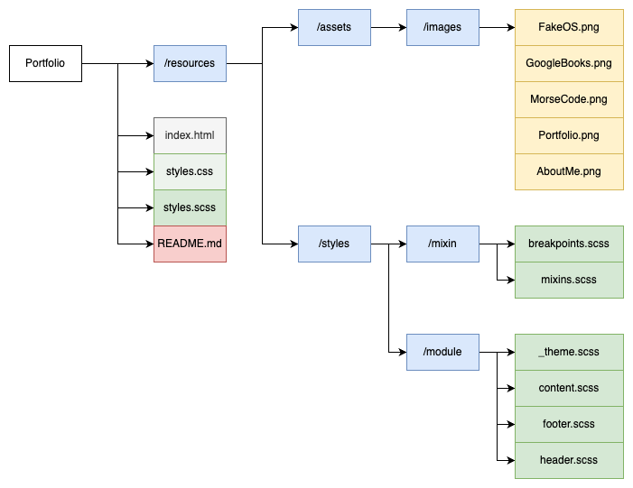

# rianns.github.io (Portfolio website)

{add test badges here, all projects you build from here on out will have tests,
therefore you should have github workflow badges at the top of your
repositories:
[Github Workflow Badges](https://docs.github.com/en/actions/monitoring-and-troubleshooting-workflows/adding-a-workflow-status-badge)}

## Demo & Snippets

-   [Live link](https://rianns.github.io/)
-   

---

## Requirements / Purpose

-   MVP

    -   Upload as a public repository on GitHub
    -   Use SCSS for styling
    -   Use B.E.M as a naming convention
    -   Responsive design: using flexbox
    -   Media Queries

-   Portfolio should contain the following sections:

    -   A landing page/section with name and title
    -   An About page/section with about me
    -   A Tech stacks/skills page/section containing the stacks learned in
        nology training
    -   A Project page/section with all your projects
        -   (use placeholder images and text at the beginning to render your
            website as it would with actual projects)
        -   each project should have a little description
        -   GitHub Repo link AND Live link
        -   A Contact page/section with your email, GitHub profile link,
            LinkedIn profile link

-   Purpose

    -   To create a working portfolio showcasing my journey and work as a
        software engineer through the projects created during the \_nology
        training.
    -   to demonstrate knowledge and application of HTML, CSS and SCSS

-   Stacks used
    -   HTML5
    -   CSS3
    -   SCSS

---

## Build Steps

### Required installations

SASS for SCSS

```cmd
npm i sass
or
npm install sass
```

### Setup

1. Create repository on GitHub to clone and work in VS Code
2. Set up the folder/file structure plan for the website



3. Reproduce the folder structure from the plan to VS Code
4. Add index.html and styles.scss in the root folder
5. Watch for sass changes and save to styles.css also saved in the root folder
   using the following command

```cmd
sass --watch --no-source-map <scss input> <css output>
sass --watch --no-source-map styles.scss styles.css
```

6. Setup breakpoints for responsive design

```scss
$sm: 480px;
$md: 768px;
$lg: 1024px;
$xl: 1200px;
$xxl: 1400px;
```

7. Setup theme including palette and fonts

FONTS - Google Fonts

-   Abril Fatface, cursive
-   Quicksand, sans-serif

Palette

```scss
$primary-color: #1e2629;
$secondary-color: #cbcdc0;
$tertiary-color: #1b4146;
$quartenary-color: #bbd1d5;
$accent-color: #bd6054;
```

---

## Design Goals / Approach

-   Minimalistic style design overall
-   Darker colour palette with light contrasting highlights and accent
-   Lowercase typography with large, bold headers

The approach to this project is to create a structured file system for easy
access to files and directories. From that, the design work and styling followed
the structure where the whole page was split into three main parts: - Header -
static, contains navigation - Main - scrollable, contains landing page, skills
and stacks, projects, and about me - Footer - static, contains copyright

In terms of responsiveness, minimalistic style design was still followed so that
the navigation changes into icons as the screen size become more restricted in
size.

---

## Features

-   Responsive design, will work for most screen sizes
-   Single-page navigation with soft-scrolling
-   Hidden description overlay for the projects, only shows when the cursor
    hovers the project image
-   Contact form to send direct message straight to owner

---

## Known issues

-   Overflowing About Me image in certain screen sizes
-   Project description overflows out of the project item container

---

## Future Goals

-   JavaScript integrations with components

---

## Change logs

### 21/05/2023 - {Styling changes, updated README.md}

-   updated README.md file for project
-   fixed some overflow on the project description container

---

## Issues

-   Getting the right sizes for the appropriate screen size.
    -   Some screens have different aspect ratios and the inspection does not
        show the differences.
    -   Work-around is to manually use different aspect ratios from different
        devices, this can be problematic and expensive

---

## Licensing Details

-   No license

---

## Further details, related projects, reimplementations

-   TBD
